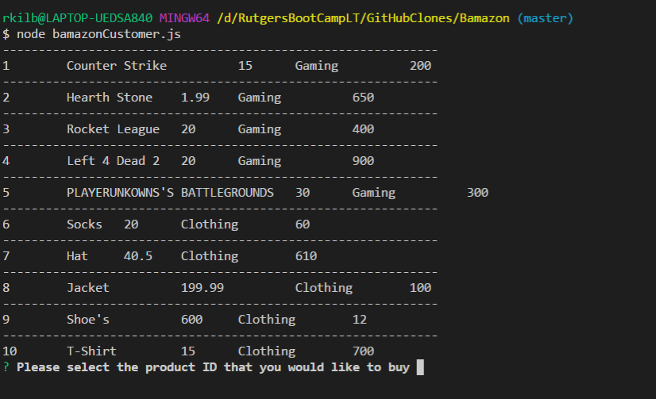

# Bamazon

Amazon like app that allows you to purchase items by their ID #
 
* Buy Items buy selecting their ID #
* After you select the ID enter the amount of that item you would like to purchase
* If there is enough of that item in stock it will sell you the goods, other wise your gonna have to wait for new order
 
App is not working properly yet. 

I am currently able to grab the data from the the database but need to add the logic so the user can grab items by their ID and how many items they would like to select.

